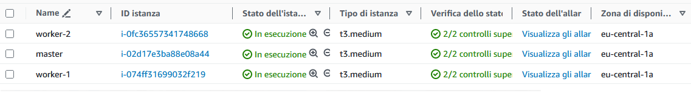
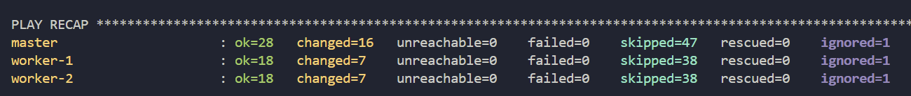
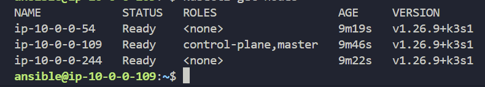
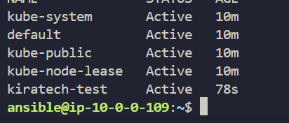
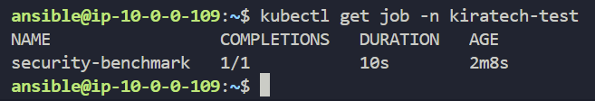
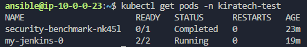

# Kiratech-DevOps-challenge

The project is born as a code challenge, the purpose of which is to configure a kubernetes cluster and deploy some applications on it. The process has to be fully automatic and designed with IaC pattern

## Project requirements
The cluster must be composed of a **master** and **two workers**, thus the infrastructure has to run on three separate vm. 
The tool used for the virtual machines provisioning can be chosen as desired. The infrastructure and virtual machines has to follow the "minimum privilege" principle.

The VMs have to be configured using **Ansible**.

The kubernetes cluster has to be installed using **Terraform**. The same tool has to be used to create a namespace named *"kiratech-test"* and to run a security benchmark.

The application has to be deployed through an **Helm chart** and must be composed of at least three services.

The last step is to configure the **continuous integration** and the code linting.


## Virtual Machine provisioning

### Infrastructure

The platform i used for the virtual machines hosting is AWS, that is for two main reasons:
- Easy integration with IaC services, such as Terraform
- All the infrastructure needed for this project falls in the AWS free plan.

In particular, the VMs are **t3.medium** EC2 instances, with the following specs:
- 2 vCpus
- 4 Gb RAM
- 5 Gbit max band burst

This relatively small VMs should be able to run a Kubernetes cluster based on **k3s**, a lighter version than usually deployed **k8s**.

Regarding the network infrastructure the most important components are:
- **Vpc** with a single subnet
- **Internet gateway** to allow the VMs to download updates and installation packets
- **Security groups** for master and worker nodes. They are configured as such:
    - **Ingress traffic** - port 6443/tcp, 22/tcp onfly for master node and 443/tcp, 80/tcp, 8472/udp for both master and workers 
    - **Internal traffic** - all traffic allowed from workers to master and port 6443/tcp, 10250/tcp from master to workers
    - **Egress traffic** - all traffic allowed

The security configuration is based on the suggested configs provided by [k3s installation guide](https://docs.k3s.io/installation/requirements#network).

### Provisioning instructions
The infrastructure is provisioned using Terraform. The whole infrastracture is described in three files:
- `main.tf`
- `vpc.tf`
- `security_group.tf`

#### Requirements:
- Terraform cli installed (~> 5.0 version)
- Working AWS account with IAM role and access keys
- SSH keypair

First you have to generate the ssh keys that will be used for vm connection and configuration
```bash
ssh-keygen -b 2048 -t rsa
```
The keys shall be named `ssh-key` and moved in `env/` directory.

Then you will need to move inside the `vm-provision/` directory
```bash
cd vm-provision/
```
Now you will need to create the `terraform.tfvars` file
```bash
touch terraform.tfvars
```
Then you will need to compile it with the required data

```yaml
access_key = "access-key"
secret_key = "secret_key"
region = "eu-central-1"
trusted_ip = "your ip"
availability_zones = [ "eu-central-1a"]
```

Now the configuration is complete, you can initialise the Terraform project and provision the infrastracture. 

```bash
terraform init
terraform plan
terraform apply -auto-approve
```

Terraform also takes care of the initial configuration of the vms, like the creation and configuration of the user `ansible` and simple dependencies installation (such as `python3`). The init commands can be found in the `init-master` and `init-worker` files.



Terraform will also provide the `master public ip address` as output of the `terraform apply`. Make sure to save the address as it will be necessary for the cluster configuration.


## K3s cluster setup

### K3s installation
The vm configuration and k3s installation is carried out using Ansible. The tool is executed by the master vm, that acts a `control node`, so the first required step is the connection to the vm

```bash
cd cluster-setup

ssh ansible@master-public-address -i ../env/ssh-key
```

The address of the master node is the one provided by the previous steps. If the error `access denied: public key` error shows up just wait a few minutes, then try again with the connection (the vm is not fully configured yet, therefore the public key has not been added to the authorized hosts).

Now that you have access to the `control node` you need to clone the [`K3s Ansible`](https://github.com/k3s-io/k3s-ansible) repository from github.

```bash
git clone https://github.com/k3s-io/k3s-ansible.git

cd k3s-ansible/
```

> I chose to install the k3s cluster using this tool instead of writing my own ansible playbooks because this repository is provided by the official k3s mantainers offers a perfect installation that grants the minimum security privilege principle.

Now we can start the installation of k3s. Instead of using the provided `inventory-sample` file, i wrote a custom inventory that uses the `Dynamic Inventory for AWS` plugin. This way you don't have to manually paste the ip addresses of the nodes in the inventory.

In order to use the dynamic inventory you need to provide once again the aws credentials that were used for the vm provisioning on terraform. It can be done using environment variables
```bash
export AWS_ACCESS_KEY_ID='your-key'
export AWS_SECRET_ACCESS_KEY='your-secret'
```

or by additional configs in the inventory file

```yaml
plugin: amazon.aws.aws_ec2
aws_access_key: "your-key" #    <-----
aws_secret_key: your-secret # <-----
aws_region: eu-central-1
hostnames:
    - tag:Name
    - private-ip-address
keyed_groups:
    - key: tags.Group
      separator: ''

groups:
    k3s-cluster: "'DevOps Challenge' in tags.Project"

compose:
    ansible_user: ansible
    ansible_host: private_ip_address
```

The variables that were previously located in the inventory-sample are provided by the `vars` file.
```yaml
ansible_user: ansible
ansible_port: 22
k3s_version: v1.26.9+k3s1
token: "KiratechChallenge"  # Use ansible vault if you want to keep it secret
api_endpoint: "{{ hostvars[groups['server'][0]]['ansible_host'] | default(groups['server'][0]) }}"
extra_server_args: ""
extra_agent_args: ""
```

You will need to create both files (name them exactly `inventory.aws_ec2.yaml` and `vars.yaml`) and paste inside the previous configuration.

You can now ru your Ansible playbook and install the k3s cluster

```bash
ansible-playbook -i inventory.aws_ec2.yaml -e @vars.yaml playbook/site.yml
``` 




Once the installation is over, you 'll need to get the kubernetes configuration file that was generated by k3s. It will be needed for the next steps.

```bash
cd ~
sudo cp  /etc/rancher/k3s/k3s.yaml .
sudo chown ansible k3s.yaml  
chmod 600 k3s.yaml
```
Now you will need to disconnect the ssh communication from the control node. The following commands are executed **in the local machine**

Enter the `cluster-setup` directory and copy the config file from the control node
```bash
cd cluster-setup

scp -i ../env/ssh-key ansible@master-public-ip:/home/ansible/k3s.yaml .
```
Edit the k3s.yaml file and replace the address of kubernetes server with the master public ip (replace `127.0.0.1` with the public ip)

### Namespace creation and kube-bench

The namespace `kiratech-test` and the security benchmark will be created using terraform, so in order to apply the configuration you will need to follow the same steps as before.
You will need the file `k3s.yaml` in the `cluster-setup` directory, it is required by the terraform provider for kubernetes to connect to the cluster.

```bash
terraform init
terraform plan
terraform apply -auto-approve
```
After this, two new resources are created:

- the `kiratech-test` namespace, as specified in the requirements

- a kubernetes Job running `kube-bench`, a widespread tool used to check if the kubernetes installation has been done following the security rules specified in [Cis security benchmark](https://www.cisecurity.org/benchmark/kubernetes/). It is also compatible with k3s.




### Application deployment

The application i chose to deploy is Jenkins, a tool for used for managing CI/CD pipelines and for other devops tasks.

The application has to be deployed via helm in the `kiratech-test` namespace

#### Jenkins deploy instructions
Connect again to the control node vm and install helm
```bash
ssh ansible@master-public-address -i ../env/ssh-key

curl -fsSL -o get_helm.sh https://raw.githubusercontent.com/helm/helm/main/scripts/get-helm-3

chmod 700 get_helm.sh

./get_helm.sh
```

Add Jenkins repository to helm

```bash
helm repo add jenkinsci https://charts.jenkins.io/
```

Install Jenkins in the `kiratech-test` namespace
```bash
helm install my-jenkins jenkinsci/jenkins --version 5.1.6 -n kiratech-test
```

You should see Jenkins running



In order to access to jenkins web ui you need to expose the service


## Continuous Integration

The continuos integration has been configured using a GitHub actions that runs `Ansible lint` and `Terraform lint` tools for every commit that modifies yaml files in the `master` branch.

References:
- [Terraform provider for AWS](https://registry.terraform.io/providers/hashicorp/aws/latest/docs/resources/instance)
- [K3s website](https://k3s.io/)
- [K3s Ansible](https://github.com/k3s-io/k3s-ansible.git)
- [AWS Dynamic Inventory](https://docs.ansible.com/ansible/latest/collections/amazon/aws/docsite/aws_ec2_guide.html)
- [Kube-bench](https://github.com/aquasecurity/kube-bench)
- [Jenkins](https://artifacthub.io/packages/helm/jenkinsci/jenkins)